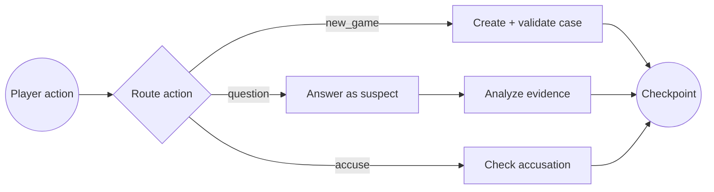

# CaseGraph

**A durable, stateful AI detective game built with LangGraph.** Generate a case, interview
suspects with isolated memories, surface evidence-backed contradictions, and make a final
accusation—all through a checkpointed workflow that survives application restarts.

[](https://github.com/MohammadJavadRamezanpour/detective_game/actions/workflows/ci.yml)


CaseGraph is designed as a compact demonstration of production-minded agent orchestration:
graph-native persistence, explicit state, conditional routing, structured model outputs,
provider-independent LLM operations, and deterministic offline tests.

## Why LangGraph?

An investigation is a long-running workflow, not a single prompt. Each player action enters the
same persisted graph thread. LangGraph routes the action, checkpoints every graph step, and merges
new conversation messages into the case state.



The workflow demonstrates:

- **Durable execution:** SQLite checkpoints are keyed by `game_id` as LangGraph `thread_id`.
- **Reducer-backed state:** `add_messages` safely accumulates LangChain messages across turns.
- **Conditional routing:** new cases, interviews, and accusations take distinct graph paths.
- **Structured output:** Pydantic validates generated cases and evidence assessments.
- **Scoped memory:** every suspect gets an independent history, preventing cross-character leakage.
- **Grounded analysis:** contradiction detection compares answers with the canonical case, alibi,
  clues, and that suspect's earlier claims.

## Product experience

The interface presents three connected views:

1. A case brief with the crime, location, and time window.
2. An evidence board containing concrete clues and contradictions discovered during interviews.
3. An interrogation room with suspect-specific memory and explainable suspicion updates.

No API key is required. With no provider configured, CaseGraph starts in deterministic offline mode
with a complete playable case—useful for evaluation, development, and CI.

## Quick start

```bash
git clone https://github.com/MohammadJavadRamezanpour/detective_game.git
cd detective_game
python3 -m venv env
source env/bin/activate
pip install -r requirements.txt
cp .env.sample .env
uvicorn backend.api:app --reload
```

Open [http://localhost:8000](http://localhost:8000). Leave all provider keys blank to use the
offline demo.

## Provider configuration

CaseGraph selects the first explicitly configured provider in this order: local model, Google,
Qwen, OpenAI, then offline mode.

| Provider | Default model | Configuration |
|---|---|---|
| Ollama/vLLM-compatible | `phi3:mini` | `LOCAL_LLM_BASE_URL`, `LOCAL_LLM_MODEL` |
| Google Gemini | `gemini-2.5-flash-lite` | `GOOGLE_API_KEY`, `GOOGLE_MODEL` |
| Qwen/DashScope | `qwen-plus` | `QWEN_API_KEY`, `QWEN_MODEL` |
| OpenAI | `gpt-4o-mini` | `OPENAI_API_KEY`, `OPENAI_MODEL` |
| Offline demo | deterministic | no keys required |

Each hosted-provider request has a timeout and bounded retries. Provider responses still pass
through the same Pydantic domain validation before they enter graph state.

## State and persistence

The graph stores the complete investigation state, including:

```text
case facts + hidden solution
global message timeline
per-suspect conversation histories
suspicion scores + structured analysis log
discovered contradictions
turn count + final verdict
```

Local checkpoints are written to `.data/casegraph.sqlite` by default. Override the path with
`CASEGRAPH_DB_PATH`. SQLite is intentionally used for a zero-infrastructure demo; a multi-instance
deployment should replace it with a shared LangGraph checkpointer such as PostgreSQL.

## API

| Method | Endpoint | Graph action |
|---|---|---|
| `POST` | `/api/new_game` | Generate and validate a case in a new thread |
| `POST` | `/api/ask` | Interview a suspect, then analyze the answer |
| `POST` | `/api/accuse` | Route to verdict and reveal the canonical solution |
| `GET` | `/api/health` | Lightweight service health check |

The public API filters criminal roles and the hidden solution until the game ends. Request models
bound suspect counts, identifiers, and question length.

## Quality checks

```bash
pip install -r requirements-dev.txt
ruff check .
python -m pytest
```

The test suite covers graph routing, reducer-backed message accumulation, suspect memory isolation,
schema failures, API validation, hidden-answer boundaries, win conditions, and checkpoint recovery
after a new `GraphManager` opens the same SQLite database. GitHub Actions runs lint and tests for
every pull request.

## Project layout

```text
backend/
├── api.py           # Validated HTTP boundary and public-state filtering
├── graph.py         # LangGraph state, nodes, routing, and checkpoint lifecycle
├── llm_strategy.py  # Provider adapters, prompts, and offline strategy
└── models.py        # Structured case and evidence schemas
static/
├── index.html       # Case board and interrogation interface
├── app.js           # Safe DOM rendering and API interactions
└── style.css        # Responsive noir-inspired UI
test/
├── test_api.py
├── test_graph.py
├── test_models.py
└── test_strategy.py
```

## Design decisions and current limits

- Suspicion is a player aid, not a guilt oracle: analysis is instructed to use concrete facts rather
  than tone, and the UI displays its rationale.
- SQLite keeps local setup simple and durable but is not intended for horizontally scaled servers.
- The vanilla frontend keeps the orchestration code easy to inspect; production deployment would
  add authentication, rate limiting, and server-side request quotas.
- Generated mysteries are schema-valid and internally constrained, but model-generated narrative
  consistency remains an evaluation area rather than a solved problem.

Licensed under the [MIT License](LICENSE).
